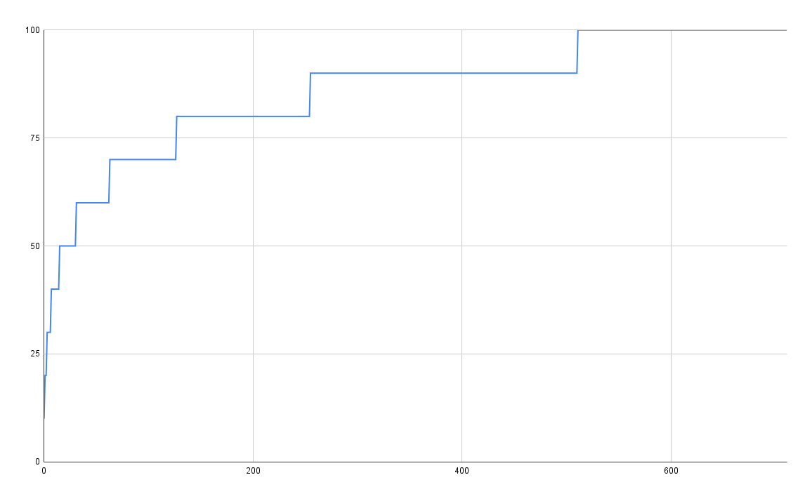
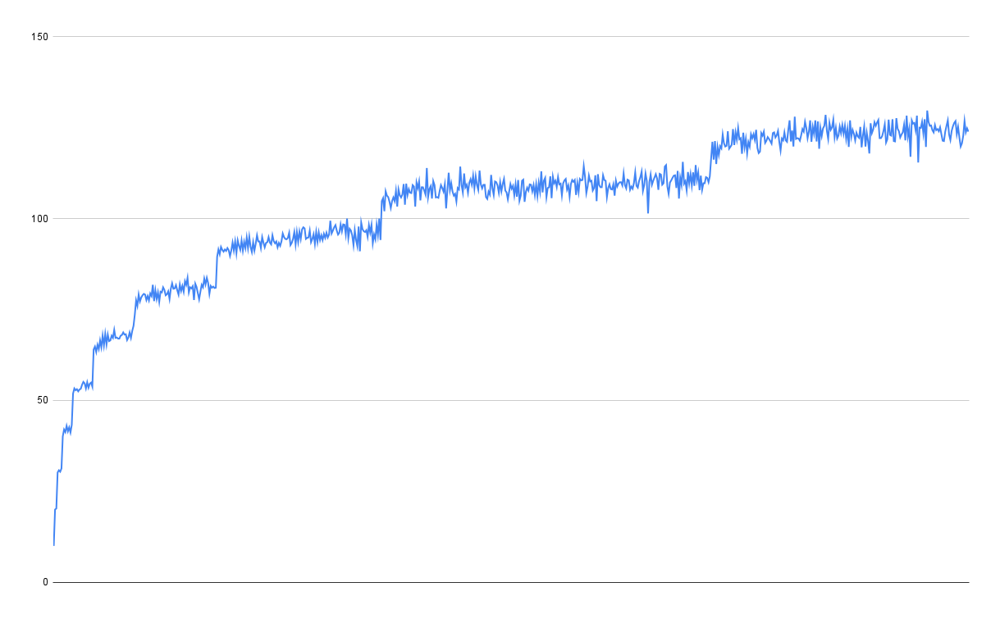
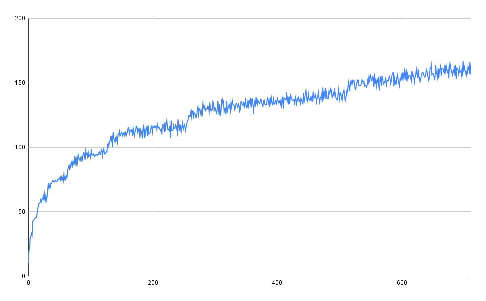

# Spaced repetition simulation

I was curious about the following question: how much does spaced repetition workload grows over time when you add a constant amount of cards per day? In order to figure out an answer to this question, I wrote a simple simulation of spaced repetition, where the interval between successive reviews doubles with each success, and resets to one day on failure. Then I ran simulation of following situation:

* Every day, 10 cards are added to the deck
* Every day, all the cards are successfully reviewed

I've simulated 2 years of continuous reviews and got the following chart as a result:

The amoun of reviews quickly grows to 50 per day, but does not exceed 100 after doing the reviews for two years. My guess before running the simulation was that the amount of reviews would not exceed 300 per day, but it turned out to be even lower.

But it's not reasonable to expect to get every card perfectly every time. How much worse the situation becomes when not every answer is successful? To answer that, I changed the simulation a bit: now for every card, a random number between 0 and 1 is generated.

* If the number is lower than given success probability, then the card is reviewed successfully and its next appearance will again occur with doubling time interval
* Otherwise, the card is reset to level 1 and will occur the next day

Then, I've counted a number of unique cards reviewed each day, and ran 10 simulations averaging the results.

For 95% probability of success, the graph looks as follows:

So while the amount of reviews grows from 100 to ~125 after 2 years of continuous reviews, it does not grow as drastically as one could have thought.

Here is another graph for 90% probability of success:

Again, the amount of reviews after two years increased quite a bit to around 160 cards per day, but it did not increase drastically.

## Simulation

Is located in file `sim.ts`. I've ran it using `deno`, but it does not use any of the APIs apart from `Map` and printing to the console, so running it in other environments should be fairly straightforward.

## Future work

Something I might do later (or you can do yourself if you're interested!):

* Doing reviews each day is an unrealistic assumption as well. How worse the review load changes if one is to do the reviews with some probability, or on fixed days of the week?
* One psychological aspect of space repetition software is that seeing a big amount of cards to review can be extremely demotivating. It would be intersted in modeling that using probability of attepmting doing the reviews after certain thresholds of active cards (e.g., if there is >500 cards to review, I might just decide to do it some other day instead). How badly does that affect the distribution of workload?